# 🧠 Personalized TMS Target Localization via Brain Image Generation Model

> Entry for the 10th National College Student Biomedical Engineering Innovation Design Competition  
> **Entry ID: 3957** · **Track: Medical Engineering AI Empowerment** · **Category: Self-Selected Project**


## 📌 Project Overview

This project proposes a brain function mapping prediction system based on generative artificial intelligence, aiming to address the difficulty in acquiring task-based fMRI data for **Alzheimer's Disease (AD) patients**. By constructing a **ViT-GAN hybrid model**, the system can generate high-quality task-based cognitive activation maps from resting-state fMRI data, covering multiple cognitive domains such as memory, language, attention, and executive function, providing imaging support for individualized Transcranial Magnetic Stimulation (TMS) target localization.

## 🎯 Core Objectives

- ✅ **Build resting-state → task-state mapping model**: Generate task-based cognitive activation maps from resting-state fMRI
- ✅ **Multi-cognitive domain independent modeling**: Support generation of maps for 7 cognitive domains (memory, language, attention, executive function, emotion regulation, visuospatial ability, social cognition)
- ✅ **Individualized modeling without healthy controls**: Use only AD patient data for training and prediction
- ✅ **Multi-dimensional evaluation system**: Combine SSIM, PSNR, G-Loss and other metrics for generation quality assessment

## 📊 Dataset

- **Source**: Alzheimer's Disease Chinese Population Multimodal MRI Database (Science Data Bank)
- **Samples**: Paired resting-state and task-based fMRI data from 146 AD patients
- **Preprocessing Pipeline**:
  - Realignment → Coregistration → Normalization → Smoothing → Filtering → Second-level Analysis
  - Processed using SPM12 toolbox, output in standard NIfTI format

## 🏗️ Model Architecture

### Overall Workflow
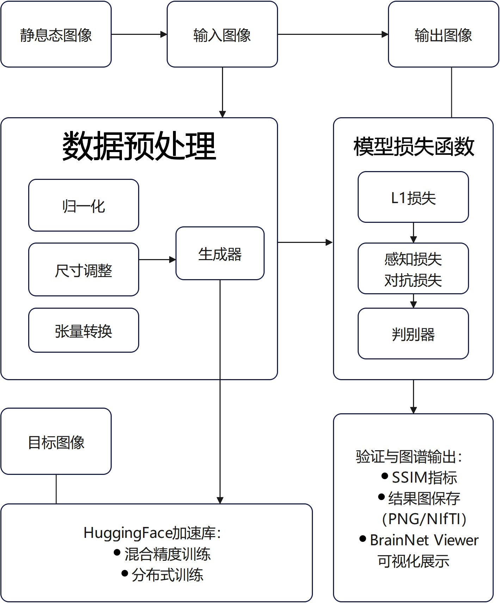

### Generator: Residual_mid_UNet3D_vit
Combines 3D UNet with Vision Transformer to enhance global modeling capability.

### Discriminator: 3D PatchGAN
Performs local authenticity discrimination on generated images to improve detail quality.

### Loss Functions
Multi-scale loss function design:
- **L1 Reconstruction Loss**: Pixel-level structural alignment
- **Perceptual Loss**: High-level semantic feature consistency
- **Adversarial Loss**: Local detail authenticity optimization

## ⚙️ Technical Implementation

### Data Processing & Input Standardization
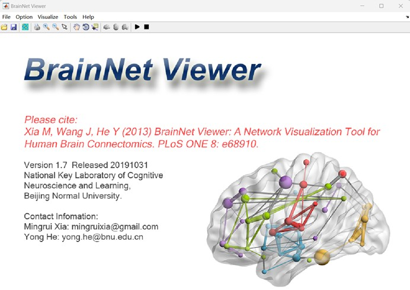

### Model Training Configuration
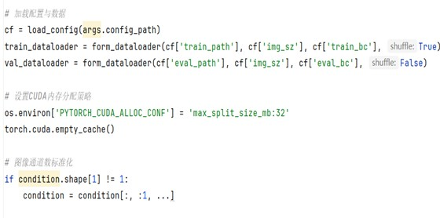
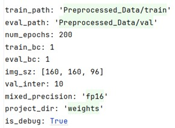

### Validation Mechanism
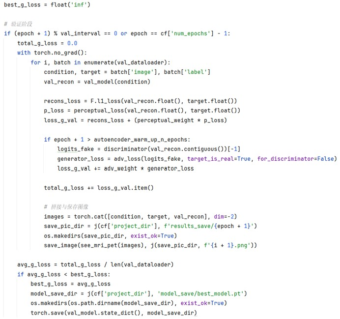

### Phase-wise Training Strategy
- **Warm-up Stage (first 10 epochs)**: Only L1 and perceptual losses
- **Adversarial Stage (epochs 11-200)**: Add adversarial loss for detail refinement

## 📈 Results & Evaluation

### Quantitative Metrics
#### SSIM (Structural Similarity Index Measure)
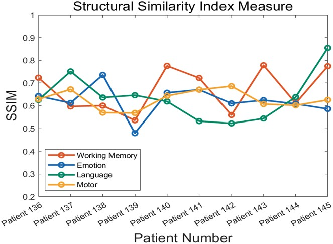
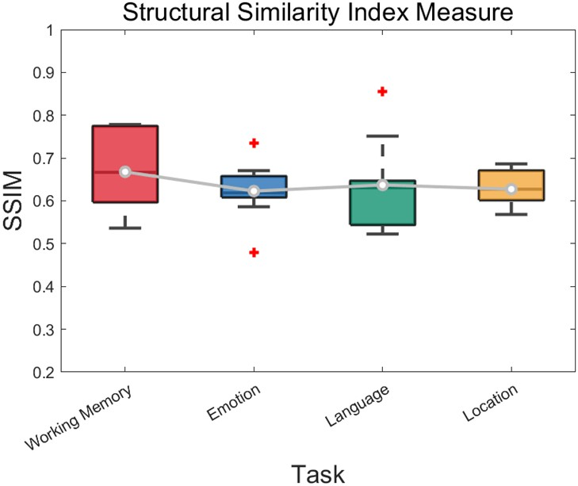

#### PSNR (Peak Signal-to-Noise Ratio)

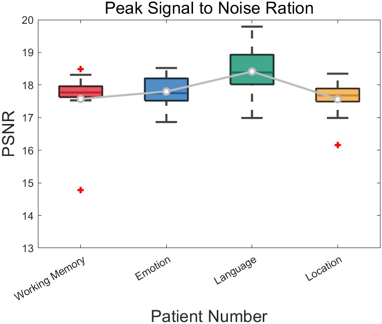

### Cognitive Domain Performance
**Working Memory**: Median SSIM = 0.6667, Median PSNR = 17.7691 dB  
**Emotion**: Median SSIM = 0.6373, Median PSNR = 17.7489 dB  
**Language**: Median SSIM = 0.6273, Median PSNR = 18.3978 dB  
**Motor**: Median SSIM = 0.6271, Median PSNR = 17.5577 dB  

### 3D Visualization of Brain Activation Patterns
Generated using BrainNet Viewer to visualize activation patterns in standard brain space.

#### Emotion Domain
 

#### Language Domain
 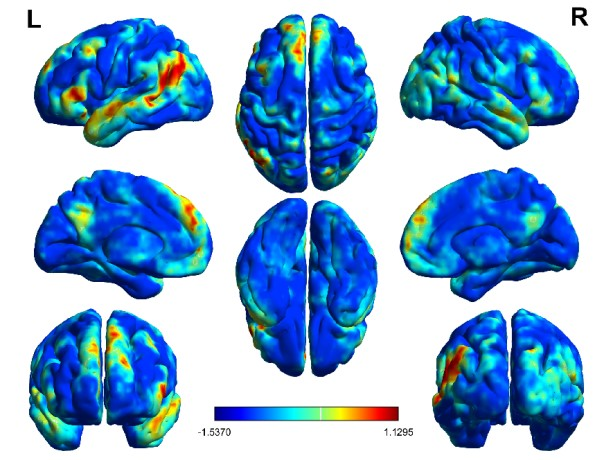

#### Working Memory Domain
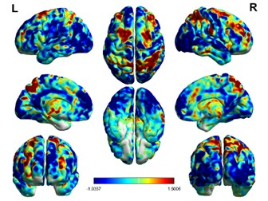 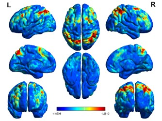

#### Motor Domain
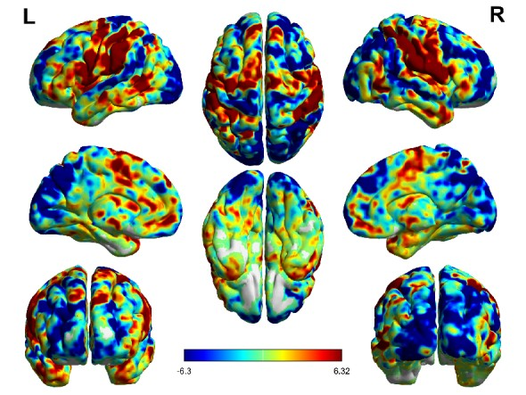 

## 🚀 Installation & Usage

### Prerequisites
- Python 3.8+
- PyTorch 2.0.0+ with CUDA 11.8
- MONAI for medical image processing
- HuggingFace Accelerate for distributed training

### Environment Setup
```bash
# Install dependencies
pip install torch torchvision torchaudio --index-url https://download.pytorch.org/whl/cu118
pip install monai accelerate
```

### Running the Model
```bash
# Training
python train_mamba_diffusion.py

# Testing
python Test.py

# Model evaluation
python Model_Evaluation.py

# Visualization
python visualization.py
```

## 🏆 Key Innovations

### 1. ViT-GAN Hybrid Architecture
Combines global attention modeling of ViT with detail generation capability of GAN, specifically designed for fMRI brain mapping tasks.

### 2. Multi-Cognitive Domain Output Mechanism
Independent generation of activation maps for 7 cognitive domains, enhancing clinical interpretability.

### 3. Individualized Modeling Without Healthy Controls
Trained exclusively on AD patient data, suitable for clinical scenarios with limited healthy samples.

### 4. Multi-Scale Loss Function Optimization
Combines pixel-level, feature-level, and semantic-level constraints for high-fidelity map generation.

## 📋 Project Structure

```
GAN-Vit4MRIAD/
├── config/
│   └── main_gan_vit_config.yaml          # Training configuration
├── dataloader/
│   ├── __init__.py
│   └── loader.py                         # Data loading utilities
├── picture/                              # Project images (1-45.jpg)
├── Preprocessed_Data/                    # Preprocessed fMRI data
│   ├── test/
│   ├── train/
│   └── val/
├── pytorch3dunet/                        # 3D UNet implementation
│   ├── unet3d/
│   │   ├── __init__.py
│   │   ├── buildingblocks.py
│   │   ├── diffusion.py
│   │   ├── mamba.py
│   │   ├── model.py
│   │   ├── se.py
│   │   └── utils.py
│   └── __init__.py
├── utils/                                # Utility functions
│   ├── __init__.py
│   ├── common.py
│   ├── data_normalization.py
│   └── evaluate_metrics.py               # SSIM, PSNR calculation
├── vit_pytorch_diy/                      # Vision Transformer implementation
│   ├── __init__.py
│   └── vit.py
├── Model_Evaluation.py                   # Model evaluation script
├── README.md                             # This file
├── sample.py                             # Sampling script
├── Test.py                               # Testing script
├── train_mamba_diffusion.py              # Main training script
└── visualization.py                      # Visualization script
```

## 🧪 Experimental Results

### Validation Examples
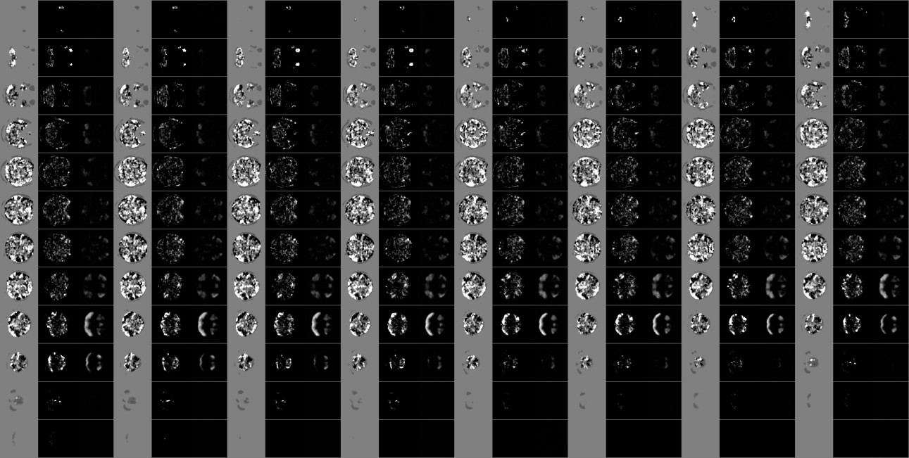
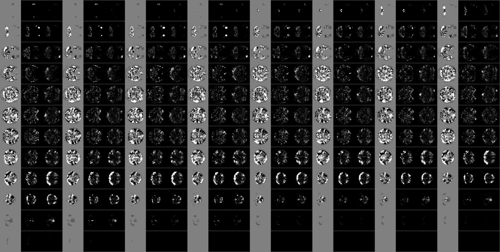

### Training Process Monitoring
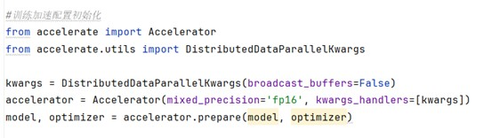
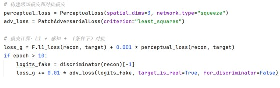

### System Components
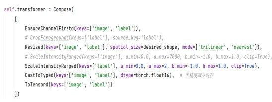
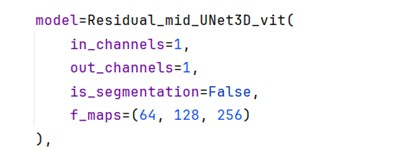
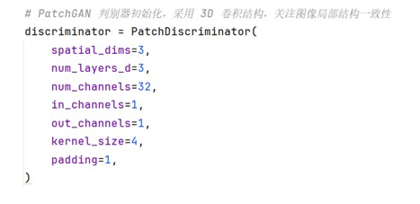
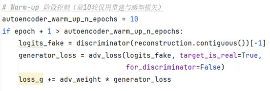
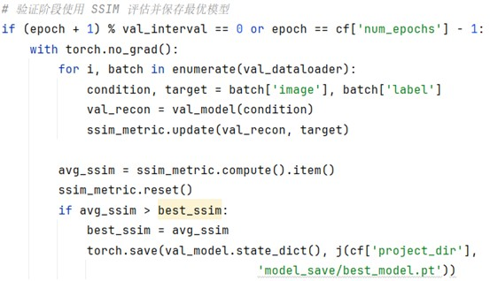

## 🔮 Future Work

1. **Complete coverage of all 7 cognitive domains** (currently 4 implemented)
2. **Develop individualized target identification mechanism** for TMS intervention
3. **Integrate structural MRI data** for combined structure-function modeling
4. **Implement graph neural networks (GNN)** for enhanced topological modeling
5. **Develop clinical interface** for doctor-friendly visualization and reporting

## 📚 References

1. Tavor, I., et al. (2016). Task-free MRI predicts individual differences in brain activity during task performance. *Nature Neuroscience*.
2. Goodfellow, I., et al. (2014). Generative Adversarial Networks. *NeurIPS*.
3. Dosovitskiy, A., et al. (2020). An Image is Worth 16x16 Words: Transformers for Image Recognition at Scale. *ICLR*.
4. ADNI Database: http://adni.loni.usc.edu/
5. BrainNet Viewer: https://www.nitrc.org/projects/bnv/

## 👥 Team

- **Institution**: shanghai University

## 📄 License

This project is for academic research purposes only. Please cite appropriately if used in research.

## 📬 Contact

For questions or collaboration inquiries, please contact: [swenbo931@gmail.com]

---

*This project was developed for the 10th National College Student Biomedical Engineering Innovation Design Competition (2025).*

